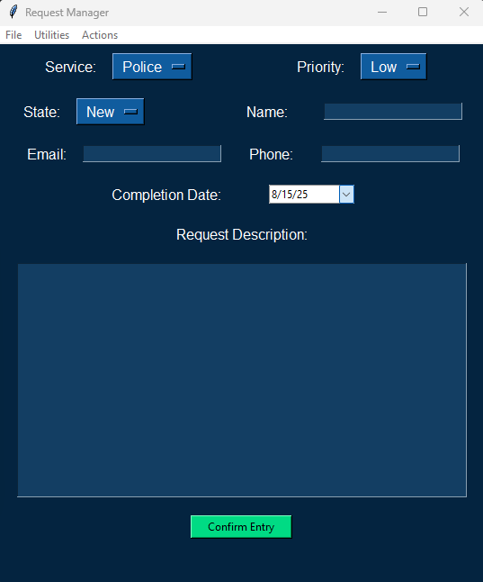
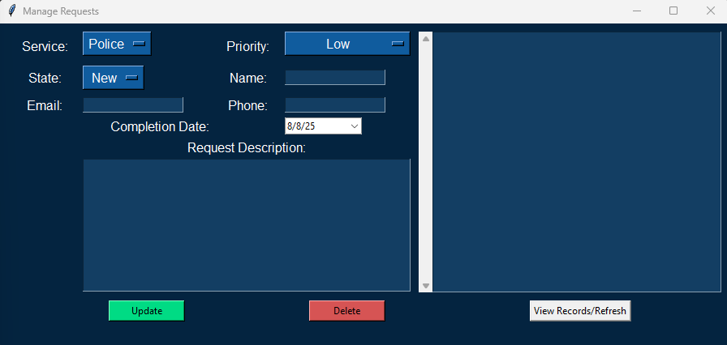
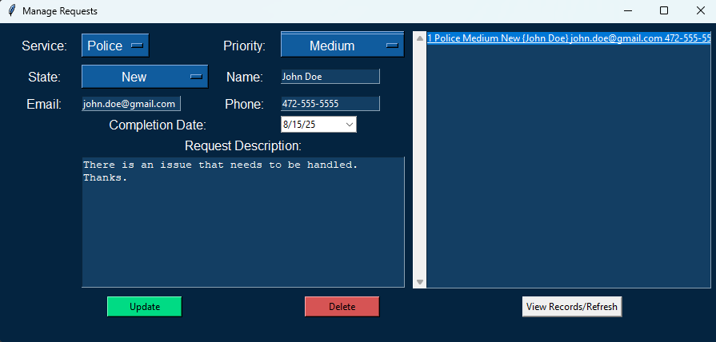
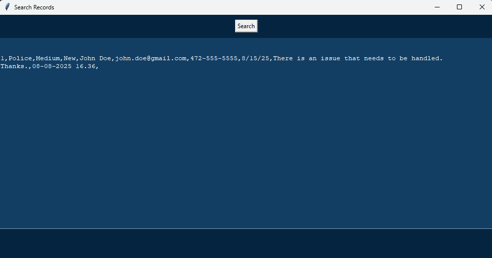

# Tkinter-Request-GUI

I created this Request Manager GUI app using Python and SQLite.

This application was created for a City Administrator. To help funnel real world requests into a form that was organized and readable. To help the user identify important tasks that needed addressed and to prioritize them accordingly.  

## Request Manager

Below is the main screen for inputing requests. Where you can input all the basic information to the requesting department or service as well as priority and whether it is in a new, in-progress or resolved state. Upon entering a new request, you will be asked if you would like it emailed to you. You may select for the app to do so or not.

 
 

## Manage Requests 

Below is a secondary screen you can use to help better manage your requests. It will allow you to select a request entry and update it or delete it from your requests on file.

 
 

 
 
Below shows you when there is a record you can select it and will auto-populate with the relevant information.
 
 

 
 

## Search Records

Along side managing your requests you are also able to view all your requests and print them out as CSV if you desire.
 
 

 
 
Also built is a function to check the last day the application was ran to see if there are any outstanding requests to remind you.

